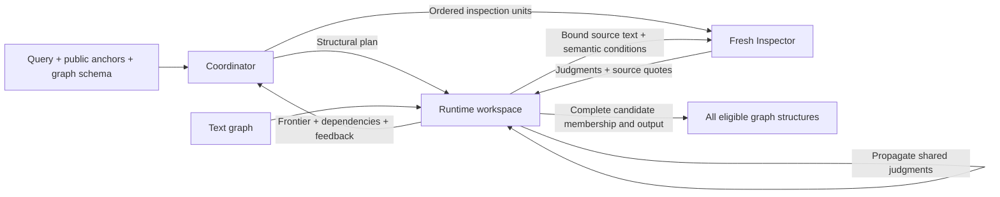

# MA-SGE: Semantic Graph Reasoning

MA-SGE answers natural-language queries over graphs whose nodes and edges carry
text. A **Coordinator** translates the request into a structural operation and
semantic conditions, then selects evidence to investigate. An independent
**Inspector** judges the supplied text. The **Runtime** enumerates structural
candidates, shares equivalent judgments across candidates, propagates their
effects, and assembles the complete eligible result set.

This repository contains the core framework, its public graph interface, and
offline regression tests. Python 3.11 is required.



## Method

1. **Interpret and ground.** The Coordinator declares roles, topology, fixed
   bindings, symmetry, semantic targets, quantifiers, and output requirements.
   The Runtime validates graph references and binding constraints.
2. **Construct the candidate domain.** The selected graph operation enumerates
   all structural assignments within the execution limits. Candidates are
   grounded into formulas over reusable semantic judgments.
3. **Investigate unresolved evidence.** The Coordinator selects an ordered
   sequence of inspection units using the current frontier, candidate
   dependencies, and query-local memory. Each Inspector receives fresh context
   containing its conditions, bindings, and complete supplied source text.
4. **Propagate and reuse.** Accepted judgments update every dependent candidate.
   A later inspection can be skipped when it no longer affects membership or
   required output. Context-sensitive judgments are shared only when their
   complete grounding agrees.
5. **Complete the answer.** The Runtime returns all eligible structures when
   the candidate lower and upper bounds agree, output obligations are satisfied,
   and no relevant evidence remains blocked. An incomplete execution returns
   `unresolved`, rather than treating missing work as an empty answer.

The structural interfaces are connected injective `pattern` matching, all tied
unweighted `shortest_paths`, and `anchored_core` extraction. Operation selection
comes from the Coordinator's interpretation; the framework has no query-label
router. See [Architecture](docs/architecture.md) for the exact semantics and
completion rule.

## Install

From this repository, using Python 3.11:

```sh
python -m pip install .
```

Set the credential for your selected provider in the environment, or copy
`.env.example` to `.env` in the directory from which you will run the command.
Existing environment variables take precedence.

## Run on your graph

Prepare a public JSON graph following the [input contract](docs/usage.md#graph-input).
Validate it without contacting a model:

```sh
masge validate --graph graph.json
```

Run one query, choosing an anchor from that graph:

```sh
masge run --graph graph.json --query "YOUR NATURAL-LANGUAGE QUERY" --anchor 0 --model deepseek-v4-pro --effort none --output artifacts/run-001 --allow-api
```

`--allow-api` explicitly enables external model calls for that invocation.
Use a new output directory for each run. `python -m masge` provides the same
commands. [Usage](docs/usage.md) documents provider configurations, graph fields,
execution limits, and result files.

## Python interface

```python
import asyncio
from pathlib import Path

from masge import ExecutionLimits, NativeProvider, Solver, load_graph


async def solve():
    graph, schema = load_graph(Path("graph.json"))
    output = Path("artifacts/python-run-001")
    output.mkdir(parents=True, exist_ok=False)
    limits = ExecutionLimits()
    provider = NativeProvider("deepseek-v4-pro", limits, output, reasoning_effort="none")
    try:
        return await Solver(graph, provider, limits, output).run(
            "YOUR NATURAL-LANGUAGE QUERY", [0], schema
        )
    finally:
        await provider.close()


# This invokes the configured external provider.
result = asyncio.run(solve())
```

A `Graph` can also be constructed directly with arrays and text/name/type
callbacks. Custom providers implement the asynchronous `Provider` protocol in
`masge.agentic.provider`. Create a new Solver and provider for each query.

## Development

```sh
python -m pip install -e ".[dev]"
python -m pytest -q -p no:cacheprovider
ruff check src tests
python -m mypy src/masge
python -m build
```

Tests use local scripted replies and mocked HTTP transports. They do not call
external models. GitHub Actions runs the same checks and an installed-wheel
smoke test. Current verification and limitations live in
[Framework status](docs/status/FRAMEWORK_STATUS.md).

## Scope

The package operates on unweighted text graphs and its three declared structural
interfaces. It does not execute model-generated Python. Semantic correctness
depends on the query interpretation and Inspector judgments; execution
completion does not certify their correctness. Graph enumeration limits are
explicit, and shortest-path semantics filter the globally shortest structural
paths rather than search for a longer semantically feasible path.

Benchmarks, gold answers, experiment variants, historical metrics, raw datasets,
and recorded model runs are outside this distribution. See
[Benchmark status](docs/status/BENCHMARK_STATUS.md) for the scope boundary.

Released under the [MIT License](LICENSE).
